# 1 Attention Is All You Need
- [论文链接](https://arxiv.org/pdf/1706.03762.pdf)

&nbsp;&nbsp;&nbsp;&nbsp;&nbsp;&nbsp;&nbsp;&nbsp;提出了一种新的简单的网络架构Transformer，仅基于attention机制并完全避免循环(RNN)和卷积(Convolution)。<br>

&nbsp;&nbsp;&nbsp;&nbsp;&nbsp;&nbsp;&nbsp;&nbsp;在各种任务中，attention机制已经成为**序列**建模和转导模型不可或缺的一部分，它可以建模依赖关系而不考虑其在输入或输出序列中的距离。 除少数情况外，这种attention机制都与循环网络一起使用。<br>

&nbsp;&nbsp;&nbsp;&nbsp;&nbsp;&nbsp;&nbsp;&nbsp;在这项工作中论文提出Transformer，这种模型架构避免循环并完全依赖于attention机制来绘制输入和输出之间的全局依赖关系。 Transformer允许进行更多的并行化，并且可以在八个P100 GPU上接受少至十二小时的训练后达到翻译质量的新的最佳结果。<br>

&nbsp;&nbsp;&nbsp;&nbsp;&nbsp;&nbsp;&nbsp;&nbsp;Self-attention，有时称为intra-attention，是一种attention机制，它关联单个序列的不同位置以计算序列的表示。<br>

&nbsp;&nbsp;&nbsp;&nbsp;&nbsp;&nbsp;&nbsp;&nbsp;Transformer是第一个完全依靠self-attention来计算输入和输出表示而不使用序列对齐RNN或卷积的转导模型。Transformer 模型一经推出便取得 各项NLP 任务 的SOTA 效果，之后更是蔓延到了vision 领域等其他领域，呈现一发不可收的迹象。因此有必要对Transformer模型有一个全面认识。<br>

# 2 Transformer Model Architecture

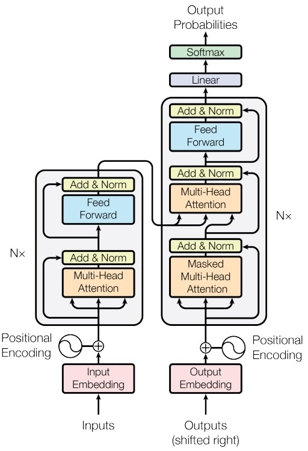

&nbsp;&nbsp;&nbsp;&nbsp;&nbsp;&nbsp;&nbsp;&nbsp;大部分神经序列转导模型都有一个编码器-解码器结构。 这里，编码器映射一个用符号表示的输入序列 $(x_{1}, \dots, x_{n})$ 到一个连续的表示 $z = (z_{1}, \dots, z_{n})$ 。 根据z，解码器生成符号的一个输出序列 $(y_{1}, \dots, y_{m})$ ，一次一个元素。 在每一步中，模型都是自回归的，当生成下一个时，使用先前生成的符号作为附加输入。<br>

&nbsp;&nbsp;&nbsp;&nbsp;&nbsp;&nbsp;&nbsp;&nbsp;Transformer遵循这种整体架构，编码器和解码器都使用self-attention堆叠和point-wise、完全连接的层，分别显示在上图的左边和右边。<br>

# 3 编码器和解码器堆栈
## 3.1 编码器：
&nbsp;&nbsp;&nbsp;&nbsp;&nbsp;&nbsp;&nbsp;&nbsp;编码器由N = 6 个完全相同的层堆叠而成。 每一层都有两个子层。 第一个子层是一个multi-head self-attention机制，第二个子层是一个简单的、位置完全连接的前馈网络。 我们对每个子层再采用一个残差连接，接着进行层标准化。也就是说，每个子层的输出是LayerNorm(x + Sublayer(x))，其中Sublayer(x) 是由子层本身实现的函数。 为了方便这些残差连接，模型中的所有子层以及嵌入层产生的输出维度都为dmodel = 512。<br>

## 3.2 解码器：
&nbsp;&nbsp;&nbsp;&nbsp;&nbsp;&nbsp;&nbsp;&nbsp;解码器同样由N = 6 个完全相同的层堆叠而成。 除了每个编码器层中的两个子层之外，解码器还插入第三个子层，该层对编码器堆栈的输出执行multi-head attention。 与编码器类似，我们在每个子层再采用残差连接，然后进行层标准化。 我们还修改解码器堆栈中的self-attention子层，以防止位置关注到后面的位置。 这种掩码结合将输出嵌入偏移一个位置，确保对位置的预测 i 只能依赖小于i 的已知输出。<br>

# 4 Scaled Dot-Product Attention（缩放版本的点积注意力）
&nbsp;&nbsp;&nbsp;&nbsp;&nbsp;&nbsp;&nbsp;&nbsp;Attention可以描述为将query和一组 **key-value对** 映射到输出(output)，其中query、key、value和 output都是向量(vector)。 输出为value的加权和，其中分配给每个value的权重通过query与相应key的兼容函数来计算。

## 4.1 模型结构图
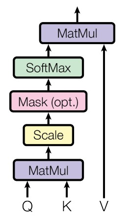

## 4.2 数学公式为
$$Attention(Q, K, V)=softmax(\frac{Q K^{T}}{\sqrt{d_{k}}}) V $$

## 4.3 推导过程详解
### 4.2.1 self attention 的思想
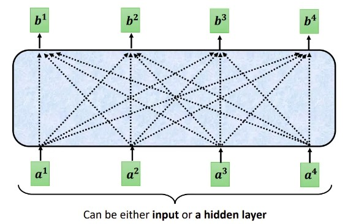

&nbsp;&nbsp;&nbsp;&nbsp;&nbsp;&nbsp;&nbsp;&nbsp;每个Self-attention的输出，都是考虑了所有的输入向量才生成出来的, 如上图所示。需要注意的是这些向量可能是整个网络的输入，也可能是某个隐藏层的输出<br>

### 4.2.2 自注意的思想 
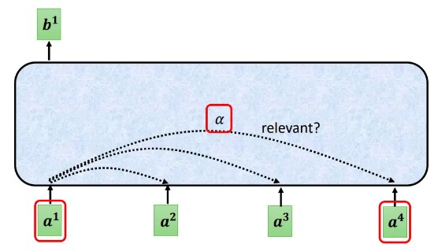

**思考：如何找到两个向量间的相关性** <br>

- 向量相关性1：Additive** <br>
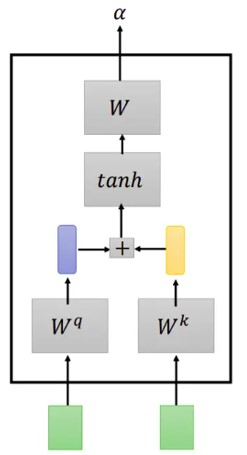

- 向量相关性2：Dot Product** <br>
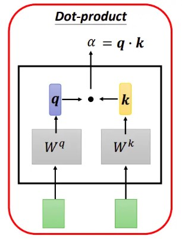

&nbsp;&nbsp;&nbsp;&nbsp;&nbsp;&nbsp;&nbsp;&nbsp;在实践中Dot-Product 的速度更快、更节省空间，因为它可以使用高度优化的矩阵乘法代码来实现。<br>

### 4.2.3 自注意机制运算过程
- 单个 token 权重系数的计算 <br>
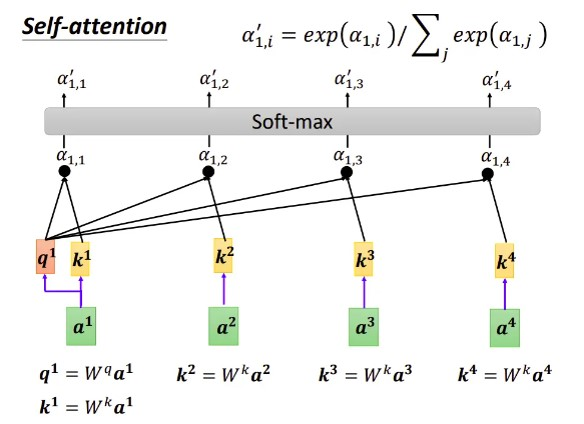

- 输入 token 对应的输出的计算 <br>
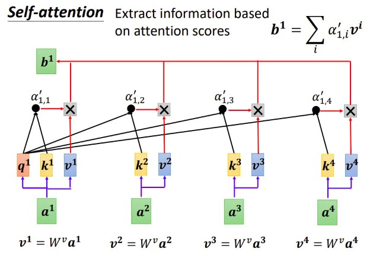

- 其它 token 对应的输出的计算 <br>
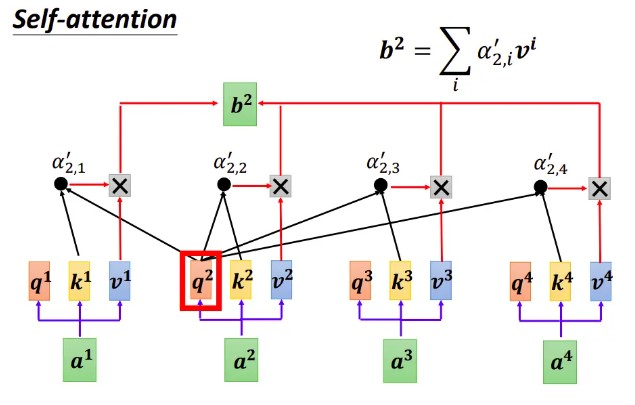

- 真实数据举例
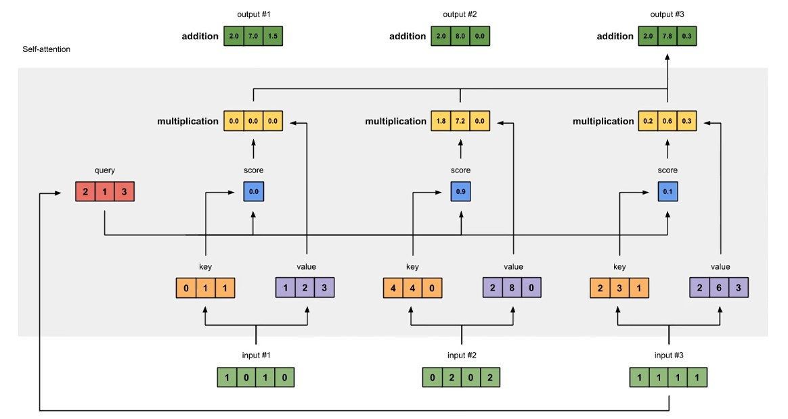

### 4.2.4 写成矩阵的形式
- 矩阵化 Q K V 的获取过程：<br>
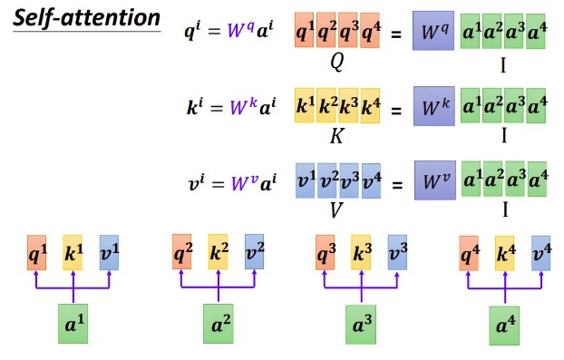

- attention score 的获取写成矩阵形式 <br>
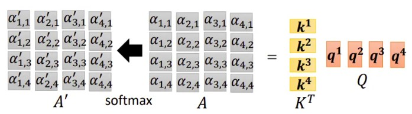

**得到的矩阵我们称之为 Attenion Matrix.**

- Value 加权平均过程 写成矩阵形式 <br>
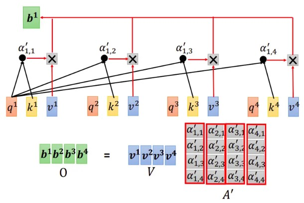

- 最后，我们将整个过程表达为矩阵形式 <br>
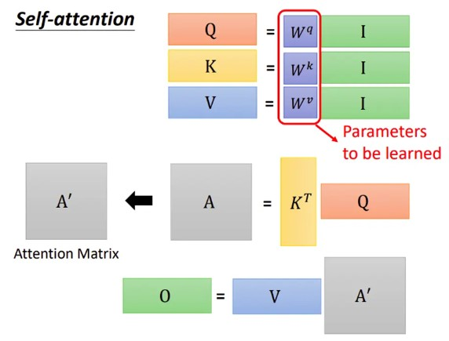

## 4.4 为什么要进行缩放
&nbsp;&nbsp;&nbsp;&nbsp;&nbsp;&nbsp;&nbsp;&nbsp;当 $d_{k}$ 的值比较小的时候，两种点击机制(additive 和 Dot-Product)的性能相差相近，当 $d_{k}$ 比较大时，additive attention 比不带scale 的点积attention性能好。 我们怀疑，对于很大的 $d_{k}$ 值，点积大幅度增长，将softmax函数推向具有极小梯度的区域。 为了抵消这种影响，我们缩小点积 $\frac{1}{\sqrt{d_{k}}}$ 倍。<br>

# 5 Multi-Head self Attention
## 5.1 原理简介
&nbsp;&nbsp;&nbsp;&nbsp;&nbsp;&nbsp;&nbsp;&nbsp;论文提出将query、key和value分别用不同的、学到的线性映射(其实就是Linear) 映射到 h 倍 到 $d_{q}$ 、 $d_{k}$ 和 $d_{v}$ 维效果更好，而不是用 $d_{model}$ 维的query、key和value执行单个attention函数。 基于每个映射版本（就是每个头/每个组）的query、key和value，我们并行执行attention函数，产生 $d_v$ 维输出值。 将它们连接(concat)并再次映射（linear)，产生最终值，如下图所示。<br>

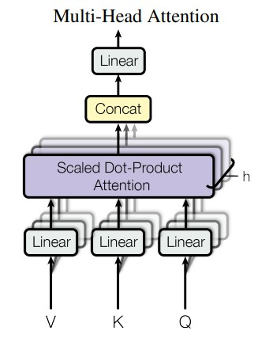

## 5.2 公式表达

$$MultiHead(Q, K, V) = Concat(head_{1}, \ldots, head_{h}) W^{O} $$

$$where head_{i} = Attention(Q W_{i}^{Q}, K W_{i}^{K}, V W_{i}^{V})$$

其中： $W_{i}^{Q} \in \mathbb{R}^{d_{model} \times d_{k}}; W_{i}^{K} \in \mathbb{R}^{d_{model} \times d_{k}}; W_{i}^{V} \in \mathbb{R}^{d_{model} \times d_{v}}; W^{O} \in \mathbb{R}^{hd_{v} \times d_{model}};$

**思考：为什么多头效果更好呢？？？**

## 5.3 底层原理
&nbsp;&nbsp;&nbsp;&nbsp;&nbsp;&nbsp;&nbsp;&nbsp;Multi-head attention允许模型的不同表示子空间联合**关注不同位置**的信息。 如果只有一个attention head，它的平均值会削弱这个信息。<br>

## 5.4 多头的实现细节展示
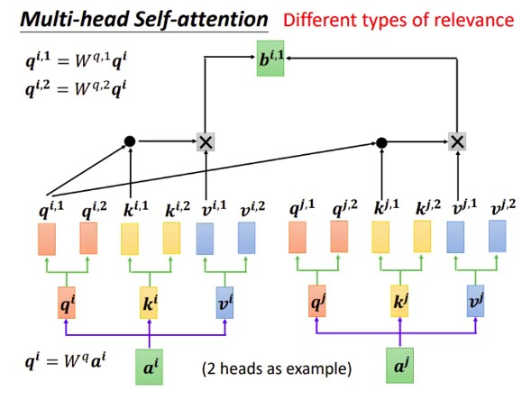

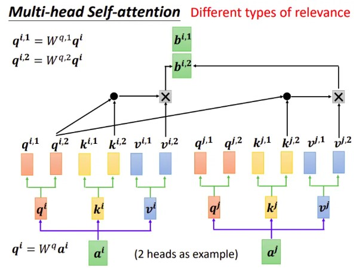

写成矩阵形式参考Dot-Product形式。<br>

# 6 实际工程上的 Multi-Head Attention 详解
- 模型下载： <br>
[encoder-shaped-model](images/encoder_shaped.onnx)

- 用netron打开查看: <br>
[netron](https://netron.app/)

# 7 Cross Multi-Head Attention
&nbsp;&nbsp;&nbsp;&nbsp;&nbsp;&nbsp;&nbsp;&nbsp;首先，Self- Attention与传统的Attention机制非常的不同：传统的Attention是基于source端和target端的隐变量（hidden state）计算Attention的，得到的结果是源端（source端）的每个词与目标端（target端）每个词之间的依赖关系。<br>
&nbsp;&nbsp;&nbsp;&nbsp;&nbsp;&nbsp;&nbsp;&nbsp;其次，Self-Attention首先分别在source端和target端进行自身的attention，仅与source input或者target input自身相关的Self -Attention，以捕捉source端或target端自身的词与词之间的依赖关系；然后再把source端的得到的self -Attention加入到target端得到的Attention中，称作为**Cross-Attention**，以捕捉source端和target端词与词之间的依赖关系。如下图的架构：<br>

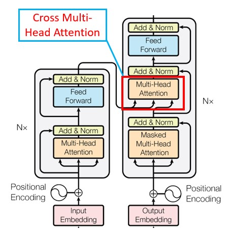

# 8 Mask Multi-Head Attention
&nbsp;&nbsp;&nbsp;&nbsp;&nbsp;&nbsp;&nbsp;&nbsp;与Encoder的Multi-Head Attention计算原理一样，只是多加了一个mask码。mask 表示掩码，它对某些值进行掩盖，使其在参数更新时不产生效果。Transformer 模型里面涉及两种 mask，分别是 padding mask 和 sequence mask。<br>

**思考：为什么需要添加这两种mask码呢？？？** <br>

## 8.1 padding mask
&nbsp;&nbsp;&nbsp;&nbsp;&nbsp;&nbsp;&nbsp;&nbsp;什么是 padding mask 呢？因为每个批次输入序列长度是不一样的也就是说，我们要对输入序列进行对齐。具体来说，就是给在较短的序列后面填充 0。但是如果输入的序列太长，则是截取左边的内容，把多余的直接舍弃。因为这些填充的位置，其实是没什么意义的，所以我们的attention机制不应该把注意力放在这些位置上，所以我们需要进行一些处理。<br>

&nbsp;&nbsp;&nbsp;&nbsp;&nbsp;&nbsp;&nbsp;&nbsp;具体的做法是，把**这些位置**的值**加上一个非常大的负数(负无穷)**，这样的话，经过 softmax，这些位置的概率就会接近0！<br>

**思考：上句中的 "这些位置" 指哪些位置呢？** <br>

- pytorch 代码实现
```python
def attention(query, key, value, mask=None, dropout=None):
    "Compute 'Scaled Dot Product Attention'"
    d_k = query.size(-1)
    scores = torch.matmul(query, key.transpose(-2, -1)) / math.sqrt(d_k)
    if mask is not None:
        scores = scores.masked_fill(mask == 0, -1e9) # mask步骤，用 -1e9 代表负无穷
    p_attn = F.softmax(scores, dim = -1)
    if dropout is not None:
        p_attn = dropout(p_attn)
    return torch.matmul(p_attn, value), p_attn
```

## 8.2 sequence mask
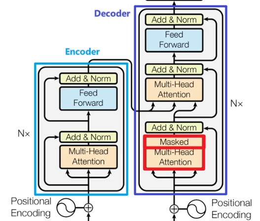

&nbsp;&nbsp;&nbsp;&nbsp;&nbsp;&nbsp;&nbsp;&nbsp;sequence mask 是为了使得 decoder 不能看见未来的信息。对于一个序列，在 time_step 为 t 的时刻，我们的解码输出应该只能依赖于 t 时刻之前的输出，而不能依赖 t 之后的输出。因此我们需要想一个办法，把 t 之后的信息给隐藏起来。这在训练的时候有效，因为训练的时候每次我们是将target数据完整输入进decoder中地，预测时不需要，预测的时候我们只能得到前一时刻预测出的输出。<br>

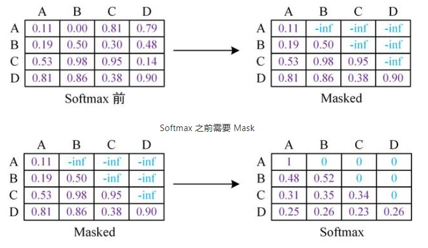

&nbsp;&nbsp;&nbsp;&nbsp;&nbsp;&nbsp;&nbsp;&nbsp;那么具体怎么做呢？也很简单：产生一个上三角矩阵，上三角的值全为0。把这个矩阵作用在每一个序列上，就可以达到我们的目的。<br>

**思考：decoder 中需要 padding mask 吗？** <br>

# 9 加速利器：KV Cache
&nbsp;&nbsp;&nbsp;&nbsp;&nbsp;&nbsp;&nbsp;&nbsp;假设 K 和 V 能直接存在缓存中，模型规模小还好，一旦模型规模很大长度很长时，KV 根本就存不进缓存。<br>

[KV Cache 课件链接](https://github.com/Elvin-Ma/ai_papers/blob/main/attention_optimize/kv-cache.md)

# 10 MQA（Multi Query Attention）
## 10.1 经典版本
- 背景：<br>
&nbsp;&nbsp;&nbsp;&nbsp;&nbsp;&nbsp;&nbsp;&nbsp;MQA（Multi Query Attention）最早是出现在2019年谷歌的一篇论文 《Fast Transformer Decoding: One Write-Head is All You Need》，之所以没有被关注到，是因为文本生成类任务还没这么火热，解码序列长度也没有现阶段大模型的要求那么高。<br>

- 核心思想：<br>
&nbsp;&nbsp;&nbsp;&nbsp;&nbsp;&nbsp;&nbsp;&nbsp;MQA 让所有的头之间 共享 同一份 Key 和 Value 矩阵，每个头只单独保留了一份 Query 参数，从而大大减少 Key 和 Value 矩阵的参数量。(Multi-query attention is identical except that the different heads share a single set of keys and values.) <br>

- 图示：<br>
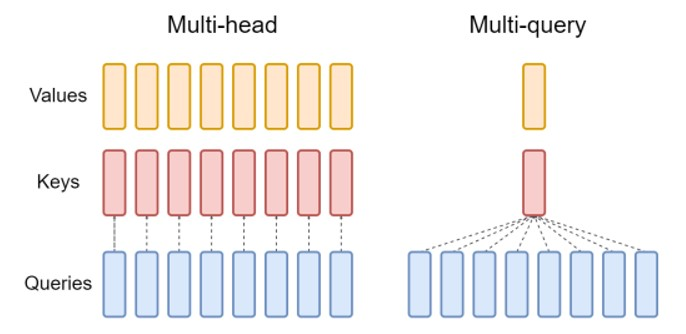

- 效果：<br>
&nbsp;&nbsp;&nbsp;&nbsp;&nbsp;&nbsp;&nbsp;&nbsp;推理速度上生成一个 token 时 MHA 和 MQA 的 encoder 分别耗时1.7us和1.5us，而 decoder 分别46us和3.8us，说明 decoder 上 MQA 比 MHA 快很多。另外在效果上 MQA 的 PPL (越小越好)有所上升，BLEU(越大越好)有所下降，换句话说就是效果有所下降。<br>

[MQA 论文](https://arxiv.org/abs/1911.02150)


# 11 大模型神器：GQA（Grouped Query Attention）
&nbsp;&nbsp;&nbsp;&nbsp;&nbsp;&nbsp;&nbsp;&nbsp;分组查询注意力(GQA)将查询头分成G个组，每个组共享一个键头和值头。GQA-G表示具有G个组的分组查询。GQA-1表示单个组，因此具有单个键头和值头，等效于MQA。而GQA-H表示组数等于头数，等效于MHA。下图显示了分组查询注意力和多头/多查询注意力的比较。在将多头检查点转换为GQA检查点时，我们通过对该组内所有原始头进行平均汇总来构建每个组的键头和值头。<br>

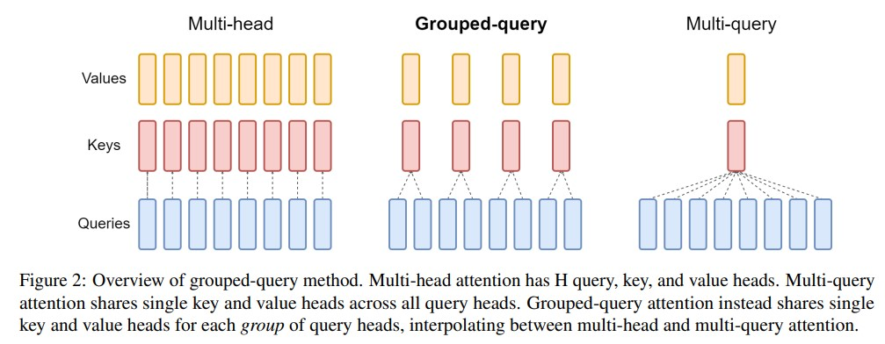

&nbsp;&nbsp;&nbsp;&nbsp;&nbsp;&nbsp;&nbsp;&nbsp;中间数量的组导致插值模型，其质量高于MQA但比MHA快，正如我们将展示的那样，这代表了一个有利的权衡。从MHA转换为MQA将H个键和值头减少为单个键和值头，将键值缓存(KV Cache)的大小减小，并且需要加载的数据量减少了H倍。然而，更大的模型通常会按比例增加头的数量，从而多查询注意力在内存带宽和容量上都具有更激进的削减。GQA使我们能够随着模型的增大而保持带宽和容量的相同比例减少。<br>
&nbsp;&nbsp;&nbsp;&nbsp;&nbsp;&nbsp;&nbsp;&nbsp;此外，较大的模型相对较少受到注意力的内存带宽开销的影响，因为KV Cache 随着模型维度的增加而扩展，而模型的FLOPs和参数随着模型维度的平方增加。最后，针对大型模型的标准分片将单个键头和值头复制了模型分区的数量（Pope等人，2022）；GQA消除了这种分区的浪费。因此，我们希望GQA在较大的模型中能够达到一个特别好的权衡。<br>
&nbsp;&nbsp;&nbsp;&nbsp;&nbsp;&nbsp;&nbsp;&nbsp;值得注意的是，GQA不适用于编码器(encoder)的自注意力层；编码器表示是并行计算的，因此内存带宽通常不是主要瓶颈。<br>

- [GQA 论文](https://arxiv.org/pdf/2305.13245.pdf)

# 12  精度改进：converting the checkpoint and uptraining

*(**uptraining** 是指对已有的模型进行进一步的训练(pre-train)或微调(fine-tune)。它可以是为了适应新的任务或结构，或者改进模型的性能。在这里， **uptraining** 是指将具有多头注意力的语言模型转换为具有多查询注意力的模型，并通过额外的预训练阶段来适应新的结构。)* <br>

- 概念 <br>
&nbsp;&nbsp;&nbsp;&nbsp;&nbsp;&nbsp;&nbsp;&nbsp;在 Multi-Query Attention 方法中只会保留一个单独的key-value头，这样虽然可以提升推理的速度，但是会带来精度上的损失。《Multi-Head Attention:Collaborate Instead of Concatenate 》这篇论文的第一个思路是基于多个 MQA 的 checkpoint 进行 finetuning，来得到了一个质量更高的 MQA 模型。这个过程也被称为 Uptraining。<br>

从多头模型生成多查询模型分为两个步骤：
- 首先是转换检查点(checkpoint)，将多头检查点转换为多查询检查点。key和value头的投影矩阵被平均汇总为单个投影矩阵，我们发现这比选择单个键和值头或从头开始随机初始化新的键和值头效果更好。
- 转换后的检查点接着使用相同的预训练方法进行预训练，但仅进行原始训练步骤的一小部分α。

- 图示：<br>
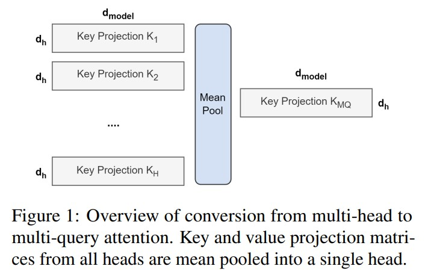

- 论文链接：<br>
[GQA 论文](https://arxiv.org/pdf/2305.13245.pdf) <br>

# 13 大模型加速利器：FlashAttention: 
## 13.1 原理介绍
&nbsp;&nbsp;&nbsp;&nbsp;&nbsp;&nbsp;&nbsp;&nbsp;论文提出了一种名为FlashAttention的新型注意力算法，它可以在较少的内存访问次数下计算精确的注意力。论文认为主要目标是避免将注意力矩阵读取和写入到HBM。为实现这一目标，论文采用了两种成熟的技术来解决这些挑战。
1. 重构了注意力计算过程，将输入分割成块，并对输入块进行多次处理，从而逐步执行softmax归一化操作（也称为切片）。<br>
2. 在前向传播中存储了softmax归一化因子，以便在后向传播中快速重新计算注意力，这比从HBM中读取中间注意力矩阵的标准方法更快。

&nbsp;&nbsp;&nbsp;&nbsp;&nbsp;&nbsp;&nbsp;&nbsp;我们使用CUDA实现了FlashAttention，以实现对内存访问的细粒度控制，并将所有注意力操作融合到一个GPU内核中。尽管由于重新计算而增加了浮点运算量，但由于大大减少了对HBM的访问量，我们的算法比标准注意力运行得更快（下图图1右图所示，GPT-2上最高可达7.6倍），并且使用的内存量与序列长度呈线性关系。<br>

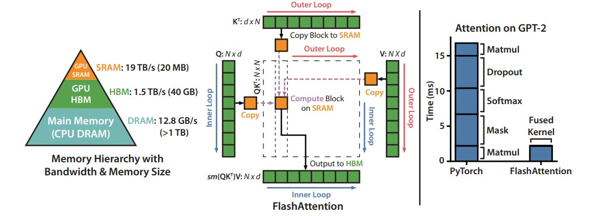
*左图：FlashAttention使用切片技术，防止在相对较慢的GPU高带宽存储器（HBM）上实例化大型的𝑁×𝑁注意力矩阵（虚线框）。在外循环（红色箭头）中，FlashAttention通过K和V矩阵的块循环，并将它们加载到快速的片上SRAM上。在每个块中，FlashAttention通过Q矩阵的块循环（蓝色箭头），将它们加载到SRAM，并将注意力计算的输出写回HBM。右图：相对于GPT-2在PyTorch实现的注意力机制，FlashAttention获得了加速。FlashAttention不需要将大型的𝑁×𝑁注意力矩阵读取和写入HBM，从而在注意力计算中获得了7.6倍的加速.*

## 13.2 标准attention机制的算法实现
&nbsp;&nbsp;&nbsp;&nbsp;&nbsp;&nbsp;&nbsp;&nbsp;给定输入序列 $Q、K、V ∈ R^{N×d}$ ，其中 N 是序列长度，d 是头维度（head dimension），我们想要计算注意力输出 $O ∈ R^{N×d}$ 。

$$\mathbf{S}=\mathbf{Q K}^{\top} \in \mathbb{R}^{N \times N}, \quad \mathbf{P}=softmax(\mathbf{S}) \in \mathbb{R}^{N \times N}, \quad \mathbf{O}=\mathbf{P V} \in \mathbb{R}^{N \times d}$$

这里，softmax 按行(row-wise)来进行。<br>
&nbsp;&nbsp;&nbsp;&nbsp;&nbsp;&nbsp;&nbsp;&nbsp;标准的注意力实现将矩阵 S 和 P 实例化到 HBM 中，这需要 $O(N^{2})$  的内存。通常情况下, $N >> d$ （例如，对于GPT2，N=1024，d=64）。我们在算法0中描述了标准的注意力实现。由于一些或大部分操作是内存密集型的（例如softmax），大量的内存访问会导致较慢的实际执行时间<br>
&nbsp;&nbsp;&nbsp;&nbsp;&nbsp;&nbsp;&nbsp;&nbsp;这个问题在应用于注意力矩阵的其他逐元素操作时会变得更加严重，例如应用于 S 的掩码操作或应用于 P 的dropout操作。因此，已经有很多尝试将多个逐元素操作融合在一起，例如将掩码操作与softmax操作融合在一起[77]。<br>
在第3.2节中，我们将展示标准的注意力实现在序列长度 N 方面进行 HBM 访问的二次方增长。我们还将比较标准注意力和我们的方法（FlashAttention）的FLOPs数量和HBM访问数量。<br>

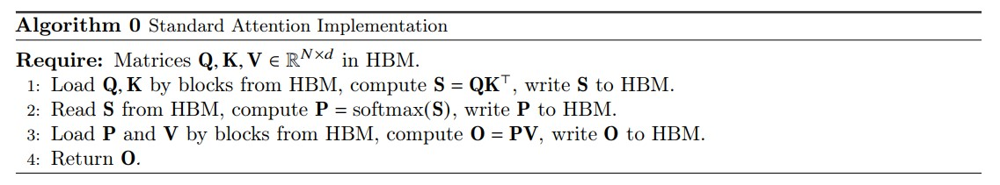

## 13.3 flash attention 算法思想
&nbsp;&nbsp;&nbsp;&nbsp;&nbsp;&nbsp;&nbsp;&nbsp;给定输入的 $Q、K、V ∈ R^{N×d}$ 存储在 HBM 中，我们的目标是计算注意力输出 $O ∈ R^{N×d}$ 并将其写入 HBM。我们的目标是减少 HBM 访问量（降低到次二次方级别的水平）。<br>
&nbsp;&nbsp;&nbsp;&nbsp;&nbsp;&nbsp;&nbsp;&nbsp;我们应用了两种已经建立的技术（切片和重计算）来克服在次二次方级别的HBM访问中计算精确注意力的技术挑战。我们在下述算法中描述了这一过程。主要思想是将输入的 Q、K、V 划分为块，从较慢的HBM加载到较快的SRAM中，然后相对于这些块计算注意力输出。通过在将每个块的输出乘以正确的归一化因子之前进行缩放并将它们相加，我们最终得到了正确的结果。<br>

## 13.4 准备：切片的方式计算softmax
&nbsp;&nbsp;&nbsp;&nbsp;&nbsp;&nbsp;&nbsp;&nbsp;我们按块计算注意力。由于 softmax 将 K 的列进行耦合，因此我们使用缩放的方法对大型 softmax 进行分解。为了数值稳定性，向量 $𝑥∈{R^B}$ 的 softmax 计算如下：<br>

$$m(x):=max(x_{i}), \quad  f(x):=\left[\begin{array}{lll} e^{x_{1}-m(x)} & \ldots & e^{x_{B}-m(x)} \end{array}\right], \quad \ell(x):=\sum_{i} f(x)_{i}, \quad softmax(x):=\frac{f(x)}{\ell(x)}$$

&nbsp;&nbsp;&nbsp;&nbsp;&nbsp;&nbsp;&nbsp;&nbsp; *(注释：在数学中，":=" 是赋值符号，表示将右侧的值赋给左侧的变量或表达式。它常用于编程语言中表示变量的初始化或赋值操作)* <br>


&nbsp;&nbsp;&nbsp;&nbsp;&nbsp;&nbsp;&nbsp;&nbsp;对于向量 $𝑥^{(1)}, 𝑥^{(2)} ∈ R^B$ ，我们可以将拼接后的向量 $𝑥 = [𝑥^{(1)}; 𝑥^{(2)}] ∈ R^{(2B)}$ 的 softmax 进行分解，如下所示：<br>

$$m(x)=m([x^{(1)} x^{(2)}])=\max (m(x^{(1)}), m(x^{(2)})),$$

$$f(x)=[e^{m(x^{(1)})-m(x)} f(x^{(1)}) \quad e^{m(x^{(2)})-m(x)} f(x^{(2)})],$$

$$\ell(x)=\ell([x^{(1)} x^{(2)}])=e^{m(x^{(1)})-m(x)} \ell(x^{(1)})+e^{m(x^{(2)})-m(x)} \ell(x^{(2)}),$$

$$softmax(x)=\frac{f(x)}{\ell(x)}.$$

## 13.5 具体flashattention的算法
&nbsp;&nbsp;&nbsp;&nbsp;&nbsp;&nbsp;&nbsp;&nbsp;如上所述：如果我们跟踪一些额外的统计信息(𝑚(𝑥), ℓ(𝑥))，我们可以一次处理一个块计算 softmax。因此，我们将输入 Q、K、V 分成块（算法1的第3行），同时计算 softmax 值和额外的统计信息（算法1的第10行），然后将结果组合起来（算法的第12行）。<br>

&nbsp;&nbsp;&nbsp;&nbsp;&nbsp;&nbsp;&nbsp;&nbsp;实现细节：Kernel fuse。切片使我们能够在一个CUDA核函数中实现我们的算法，从HBM加载输入数据，执行所有的计算步骤（矩阵乘法、softmax、可选的掩码和dropout、矩阵乘法），然后将结果写回到HBM（掩码和dropout见附录B）。这避免了反复从HBM读取和写入输入和输出的操作。<br>

**前提：Q K V 三个矩阵的形状均为[N x d], 芯片上 SRAM 尺寸为大小为 M 个elements.** <br>
- **flashattention 算法步骤详述：** <br>
1. 设置 block 大小： $B_{c} = \frac{M}{4 d}, B_{r} = min(\frac{M}{4 d}, d)$ .
2. 初始化输出矩阵 O(形状为[N x d]) 为0,  ℓ(形状N)为0，m(形状为N) 负无穷.
3. 将 Q 矩阵分割为 $T_{r} = \frac{N}{B_{r}}$ 个blocks: $Q_{1},...,Q_{T_{r}}$ , 每个block 大小为 $B_{r}$ x d, 同时将K和V 分为  $T_{c} = \frac{N}{B_{c}}$ 个blocks: $K_{1},...,K_{T_{c}}$ and $V_{1},...,V_{T_{c}}$ , 每个block size 为 $B_{c}$ x d.
4. 将output的矩阵 O 分割为 $T_{r}$ 个blocks: $O_{1},...,O_{T_{r}}$ ，每个block 大小为 $B_{r}$ x d, 将ℓ分割为 $T_{r}$ 个blocks: $ℓ_{i},...,ℓ_{T_{r}}$ , 每个大小为 $B_{r}$, 将m 分割为 $T_{r}$ 个blocks: $m_{1},...,m_{T_{r}}$ , 每个大小为 $B_{r}$.
5. for 1 ≤ j ≤ $T_{c}$ do  外层循环遍历K和V：
6. $K_{j}, V_{j}$ 从 HBM 加载到 SRAM.
7. for 1 ≤ i ≤ $T_{r}$ do 内存循环遍历Q
8. 将 $Q_{i},O_{i},ℓ_{i},m_{i}$ 从HBM 加载到SRAM
9. 在芯片上计算 $S_{i j}=Q_{i} K_{j}^{T} \in R^{B_{r} \times B_{c}}$
10. 在芯片上计算: $m_{i j}=rowmax(S_{i j}) \in R^{B_{r}}$ , $P_{i j}=exp(S_{i j}-m_{i j} \in R^{B_{r} \times B_{c}} (pointwise)$ , $ℓ_{i j}=rowsum(P_{i j}) \in R^{B_{r}}$
11. 在芯片上更新 $m_{i}^{new}, ℓ_{i}^{new}$
12. 计算 $P_{i j}V_{j}$ , 进行指数缩放，并将结果reduce 到 $O_{i}$, 最后将 $O_{i}$ 写出到 HBM
13. 将 $m_{i}^{new}, ℓ_{i}^{new}$ 复制给 $m_{i}, ℓ_{i}$ 并写出到HBM
14. end for
15. end for
16. 将 O 返回

## 13.6 重计算(recompute)
&nbsp;&nbsp;&nbsp;&nbsp;&nbsp;&nbsp;&nbsp;&nbsp;我们的目标之一是不在反向传播过程中存储 $𝑂(𝑁^2)$ 个中间值。反向传播通常需要矩阵 $S、P ∈ R^{N \times N}$ 来计算相对于Q、K、V的梯度。然而，通过存储输出O和softmax归一化统计信息(𝑚, ℓ)，我们可以在反向传播过程中从SRAM中的Q、K、V块轻松地重新计算注意力矩阵S和P。这可以看作是一种选择性梯度检查点的形式。虽然已经提出了梯度检查点技术来减少所需的最大内存量，但所有已知的实现都需要以速度换取内存。相比之下，即使有更多的FLOPs，我们的重计算由于减少了HBM访问次数而加速了反向传播过程。<br>

- [代码地址](https://github.com/Dao-AILab/flash-attention)
- [FlashAttention 论文链接](https://arxiv.org/abs/2205.14135)

# 14 其它改进方案
- FlashAttention-2: Faster Attention with Better Parallelism and Work Partitioning <br>
[FlashAttention2 论文链接](https://arxiv.org/pdf/2307.08691.pdf)

- PagedAttention <br>
[参考链接](https://blog.vllm.ai/2023/06/20/vllm.html) <br>
[page attention 论文链接](https://arxiv.org/abs/2309.06180) <br>

# 15 参考链接
- [参考链接](https://towardsdatascience.com/attn-illustrated-attention-5ec4ad276ee3)
- [书籍 + 代码](https://zh-v2.d2l.ai/chapter_attention-mechanisms/attention-scoring-functions.html)
- [read paper](https://readpaper.com/paper/2963403868)
