# 1 模型跑通
```shell
git clone https://github.com/Tongjilibo/bert4torch.git

git checkout v0.2.0

# 数据集下载：
http://s3.bmio.net/kashgari/china-people-daily-ner-corpus.tar.gz

# 预训练模型下载:
https://huggingface.co/bert-base-chinese/tree/main  

# 指定环境变量
export PYTHONPATH=*/bert4torch:$PYTHONPATH

# 或者直接安装
# python setup.py build
# python setup.py install

cd */bert4torch/examples/sequence_labeling

python3 task_sequence_labeling_ner_crf.py
```

# 2 bert 介绍
- [bert paper](https://arxiv.org/abs/1810.04805)

- [bert paper chinese](https://www.yiyibooks.cn/nlp/bert/main.html)

# 3 transformer 发展脉络
## 3.1 transformer 概述
&nbsp;&nbsp;&nbsp;&nbsp;&nbsp;&nbsp;&nbsp;&nbsp;2017 年 Google 在 [《Attention Is All You Need》](https://arxiv.org/pdf/1706.03762.pdf) 中提出了 Transformer 结构用于序列标注，在翻译任务上超过了之前最优秀的循环神经网络模型；与此同时，Fast AI 在 [《Universal Language Model Fine-tuning for Text Classification》](https://arxiv.org/pdf/1801.06146.pdf) 中提出了一种名为 ULMFiT 的迁移学习方法，将在 **大规模数据上** 预训练好的 LSTM 模型迁移用于文本分类，只用很少的标注数据就达到了最佳性能。<br>

&nbsp;&nbsp;&nbsp;&nbsp;&nbsp;&nbsp;&nbsp;&nbsp;这些具有开创性的工作促成了两个著名 Transformer 模型的出现：<br>
- GPT (the Generative Pretrained Transformer)；
- BERT (Bidirectional Encoder Representations from Transformers)。

&nbsp;&nbsp;&nbsp;&nbsp;&nbsp;&nbsp;&nbsp;&nbsp;通过将 Transformer 结构与 **无监督学习** 相结合，我们不再需要对每一个任务都从头开始训练模型，并且几乎在所有 NLP 任务上都远远超过先前的最强基准。<br>

&nbsp;&nbsp;&nbsp;&nbsp;&nbsp;&nbsp;&nbsp;&nbsp;GPT 和 BERT 被提出之后，NLP 领域出现了越来越多基于 Transformer 结构的模型，其中比较有名有：<br>

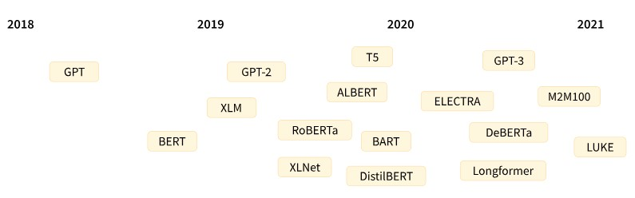

&nbsp;&nbsp;&nbsp;&nbsp;&nbsp;&nbsp;&nbsp;&nbsp;虽然新的 Transformer 模型层出不穷，它们采用不同的预训练目标在不同的数据集上进行训练，但是依然可以按模型结构将它们大致分为三类：<br>
- 纯 Encoder 模型（例如 BERT），又称自编码 (auto-encoding) Transformer 模型；
- 纯 Decoder 模型（例如 GPT），又称自回归 (auto-regressive) Transformer 模型；
- Encoder-Decoder 模型（例如 BART、T5），又称 Seq2Seq (sequence-to-sequence) Transformer 模型。

&nbsp;&nbsp;&nbsp;&nbsp;&nbsp;&nbsp;&nbsp;&nbsp;Transformer 模型本质上都是预训练语言模型，大都采用自监督学习 (Self-supervised learning) 的方式在大量生语料上进行训练，也就是说，训练这些 Transformer 模型完全不需要人工标注数据。一般说来，下面两个常用的预训练任务：<br>

- 基于句子的前 n 个词来预测下一个词，因为输出依赖于过去和当前的输入，因此该任务被称为因果语言建模 (causal language modeling), 图示如下：<br>
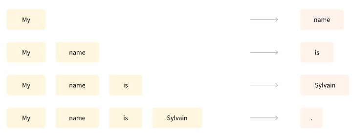

- 基于上下文（周围的词语）来预测句子中被遮盖掉的词语 (masked word)，因此该任务被称为遮盖语言建模 (masked language modeling), 图示如下：<br>
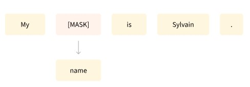

&nbsp;&nbsp;&nbsp;&nbsp;&nbsp;&nbsp;&nbsp;&nbsp;这些语言模型虽然可以对训练过的语言产生统计意义上的理解，例如可以根据上下文预测被遮盖掉的词语，但是如果直接拿来完成特定任务，效果往往并不好。<br>

&nbsp;&nbsp;&nbsp;&nbsp;&nbsp;&nbsp;&nbsp;&nbsp;因此，我们通常还会采用迁移学习 (transfer learning) 方法，使用特定任务的标注语料，以有监督学习的方式对预训练模型参数进行微调 (fine-tune)，以取得更好的性能。<br>

## 3.2 迁移学习
&nbsp;&nbsp;&nbsp;&nbsp;&nbsp;&nbsp;&nbsp;&nbsp;前面已经讲过，预训练是一种从头开始训练模型的方式：所有的模型权重都被随机初始化，然后在没有任何先验知识的情况下开始训练：<br>

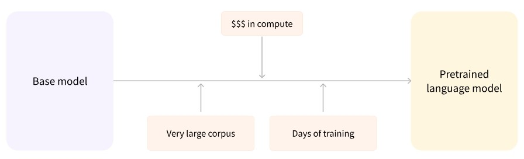

&nbsp;&nbsp;&nbsp;&nbsp;&nbsp;&nbsp;&nbsp;&nbsp;这个过程不仅需要海量的训练数据，而且时间和经济成本都非常高。<br>

&nbsp;&nbsp;&nbsp;&nbsp;&nbsp;&nbsp;&nbsp;&nbsp;因此，大部分情况下，我们都不会从头训练模型，而是将别人预训练好的模型权重通过迁移学习应用到自己的模型中，即使用自己的任务语料对模型进行“二次训练”，通过微调参数使模型适用于新任务。<br>

&nbsp;&nbsp;&nbsp;&nbsp;&nbsp;&nbsp;&nbsp;&nbsp;这种迁移学习的好处是：<br>

- 预训练时模型很可能已经见过与我们任务类似的数据集，通过微调可以激发出模型在预训练过程中获得的知识，将基于海量数据获得的统计理解能力应用于我们的任务；<br>
- 由于模型已经在大量数据上进行过预训练，微调时只需要很少的数据量就可以达到不错的性能；<br>
- 换句话说，在自己任务上获得优秀性能所需的时间和计算成本都可以很小。<br>

&nbsp;&nbsp;&nbsp;&nbsp;&nbsp;&nbsp;&nbsp;&nbsp;例如，我们可以选择一个在大规模英文语料上预训练好的模型，使用 arXiv 语料进行微调，以生成一个面向学术/研究领域的模型。这个微调的过程只需要很少的数据：我们相当于将预训练模型已经获得的知识“迁移”到了新的领域，因此被称为**迁移学习**。<br>

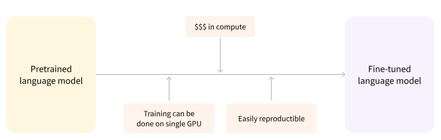

&nbsp;&nbsp;&nbsp;&nbsp;&nbsp;&nbsp;&nbsp;&nbsp;与从头训练相比，微调模型所需的时间、数据、经济和环境成本都要低得多，并且与完整的预训练相比，微调训练的约束更少，因此迭代尝试不同的微调方案也更快、更容易。实践证明，即使是对于自定义任务，除非你有大量的语料，否则相比训练一个专门的模型，基于预训练模型进行微调会是一个更好的选择。在绝大部分情况下，我们都应该尝试找到一个尽可能接近我们任务的预训练模型，然后微调它，也就是所谓的“站在巨人的肩膀上”。<br>

## 3.3 transformer 家族
&nbsp;&nbsp;&nbsp;&nbsp;&nbsp;&nbsp;&nbsp;&nbsp;虽然新的 Transformer 模型层出不穷，但是它们依然可以被归纳到以下三种结构中：<br>

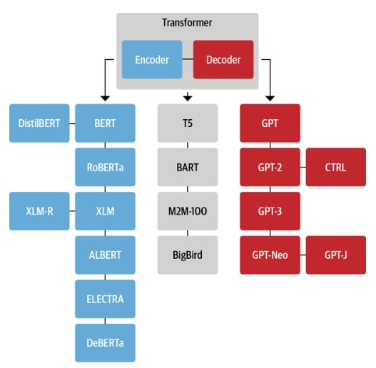

## 3.4 encoder 分支
&nbsp;&nbsp;&nbsp;&nbsp;&nbsp;&nbsp;&nbsp;&nbsp;纯 Encoder 模型只使用 Transformer 模型中的 Encoder 模块，也被称为自编码 (auto-encoding) 模型。在每个阶段，注意力层都可以访问到原始输入句子中的所有词语，即具有“双向 (Bi-directional)”注意力。<br>

&nbsp;&nbsp;&nbsp;&nbsp;&nbsp;&nbsp;&nbsp;&nbsp;纯 Encoder 模型通常通过破坏给定的句子（例如随机遮盖其中的词语），然后让模型进行重构来进行预训练，最适合处理那些需要理解整个句子语义的任务，例如句子分类、命名实体识别（词语分类）、抽取式问答。<br>

&nbsp;&nbsp;&nbsp;&nbsp;&nbsp;&nbsp;&nbsp;&nbsp;BERT 是第一个基于 Transformer 结构的纯 Encoder 模型，它在提出时横扫了整个 NLP 界，在流行的 [General Language Understanding Evaluation benchmark (GLUE)](https://arxiv.org/abs/1804.07461) 基准上超过了当时所有的最强模型。随后的一系列工作对 BERT 的预训练目标和架构进行调整以进一步提高性能。 ~~目前，纯 Encoder 模型依然在 NLP 行业中占据主导地位。~~ <br>

General Language Understanding Evaluation benchmark (GLUE),

&nbsp;&nbsp;&nbsp;&nbsp;&nbsp;&nbsp;&nbsp;&nbsp;BERT 模型及它的常见变体如下：<br>
- [BERT](https://arxiv.org/abs/1810.04805)：通过预测文本中被遮盖的词语和判断一个文本是否跟随另一个来进行预训练，前一个任务被称为遮盖语言建模 (Masked Language Modeling, MLM)，后一个任务被称为下句预测 (Next Sentence Prediction, NSP)；<br>
- [DistilBERT](https://arxiv.org/abs/1910.01108)：尽管 BERT 性能优异，但它的模型大小使其难以部署在低延迟需求的环境中。 通过在预训练期间使用知识蒸馏 (knowledge distillation) 技术，DistilBERT 在内存占用减少 40%、计算速度提高 60% 的情况下，依然可以保持 97% 的性能；<br>
- [RoBERTa](https://arxiv.org/abs/1907.11692)：BERT 之后的一项研究表明，通过修改预训练方案可以进一步提高性能。 RoBERTa 在更多的训练数据上，以更大的批次训练了更长的时间，并且放弃了 NSP 任务。与 BERT 模型相比，这些改变显著地提高了模型的性能；<br>
- [XLM](https://arxiv.org/abs/1901.07291)：跨语言语言模型 (XLM) 探索了构建多语言模型的多个预训练目标，包括来自 GPT 的自回归语言建模和来自 BERT 的 MLM，还将 MLM 拓展到多语言输入，提出了翻译语言建模 (Translation Language Modeling, TLM)。XLM 在多个多语言 NLU 基准和翻译任务上都取得了最好的性能；<br>
- [XLM-RoBERTa](https://arxiv.org/abs/1911.02116)：跟随 XLM 和 RoBERTa，XLM-RoBERTa (XLM-R) 通过升级训练数据来改进多语言预训练。其基于 Common Crawl 创建了一个 2.5 TB 的语料，然后运用 MLM 训练编码器，由于没有平行对照文本，因此移除了 XLM 的 TLM 目标。最终，该模型大幅超越了 XLM 和多语言 BERT 变体；<br>
- [ALBERT](https://arxiv.org/abs/1909.11942)：ALBERT 通过三处变化使得 Encoder 架构更高效：首先将词嵌入维度与隐藏维度解耦以减少模型参数；其次所有模型层共享参数；最后将 NSP 任务替换为句子排序预测（判断句子顺序是否被交换）。这些变化使得可以用更少的参数训练更大的模型，并在 NLU 任务上取得了优异的性能；<br>
- [ELECTRA](https://arxiv.org/abs/2003.10555)：MLM 在每个训练步骤中只有被遮盖掉词语的表示会得到更新。ELECTRA 使用了一种双模型方法来解决这个问题：第一个模型继续按标准 MLM 工作；第二个模型（鉴别器）则预测第一个模型的输出中哪些词语是被遮盖的，这使得训练效率提高了 30 倍。下游任务使用时，鉴别器也参与微调；<br>
- [DeBERTa](https://arxiv.org/abs/2006.03654)：DeBERTa 模型引入了两处架构变化。首先将词语的内容与相对位置分离，使得自注意力层 (Self-Attention) 层可以更好地建模邻近词语对的依赖关系；此外在解码头的 softmax 层之前添加了绝对位置嵌入。DeBERTa 是第一个在 [SuperGLUE](https://arxiv.org/abs/1905.00537) 基准上击败人类的模型。<br>

## 3.5 Decoder 分支
&nbsp;&nbsp;&nbsp;&nbsp;&nbsp;&nbsp;&nbsp;&nbsp;纯 Decoder 模型只使用 Transformer 模型中的 Decoder 模块。在每个阶段，对于给定的词语，注意力层只能访问句子中位于它之前的词语，即只能迭代地基于已经生成的词语来逐个预测后面的词语，因此也被称为自回归 (auto-regressive) 模型。<br>

&nbsp;&nbsp;&nbsp;&nbsp;&nbsp;&nbsp;&nbsp;&nbsp;纯 Decoder 模型的预训练通常围绕着预测句子中下一个单词展开。纯 Decoder 模型适合处理那些只涉及文本生成的任务。<br>

&nbsp;&nbsp;&nbsp;&nbsp;&nbsp;&nbsp;&nbsp;&nbsp;对 Transformer Decoder 模型的探索在在很大程度上是由 OpenAI 带头进行的，通过使用更大的数据集进行预训练，以及将模型的规模扩大，纯 Decoder 模型的性能也在不断提高。<br>

&nbsp;&nbsp;&nbsp;&nbsp;&nbsp;&nbsp;&nbsp;&nbsp;下面就简要介绍一些常见的生成模型：<br>

- [GPT](https://openai.com/blog/language-unsupervised)：结合了 Transformer Decoder 架构和迁移学习，通过根据上文预测下一个单词的预训练任务，在 BookCorpus 数据集上进行了预训练。GPT 模型在分类等下游任务上取得了很好的效果；<br>
- [GPT-2](https://openai.com/blog/better-language-models/)：受简单且可扩展的预训练方法的启发，OpenAI 通过扩大原始模型和训练集创造了 GPT-2，它能够生成篇幅较长且语义连贯的文本；<br>
- [CTRL](https://arxiv.org/abs/1909.05858)：GPT-2 虽然可以根据模板 (prompt) 续写文本，但是几乎无法控制生成序列的风格。条件 Transformer 语言模型 (Conditional Transformer Language, CTRL) 通过在序列开头添加特殊的“控制符”以控制生成文本的风格，这样只需要调整控制符就可以生成多样化的文本；<br>
- [GPT-3](https://arxiv.org/abs/2005.14165)：将 GPT-2 进一步放大 100 倍，GPT-3 具有 1750 亿个参数。除了能生成令人印象深刻的真实篇章之外，还展示了小样本学习 (few-shot learning) 的能力。这个模型目前没有开源；<br>
- [GPT-Neo](https://zenodo.org/record/5297715) / [GPT-J-6B](https://github.com/kingoflolz/mesh-transformer-jax)：由于 GPT-3 没有开源，因此一些旨在重新创建和发布 GPT-3 规模模型的研究人员组成了 EleutherAI，训练出了类似 GPT 的 GPT-Neo 和 GPT-J-6B 。当前公布的模型具有 1.3、2.7、60 亿个参数，在性能上可以媲美较小版本的 GPT-3 模型。<br>

## 3.6 Encoder-Decoder 分支
&nbsp;&nbsp;&nbsp;&nbsp;&nbsp;&nbsp;&nbsp;&nbsp;Encoder-Decoder 模型（又称 Seq2Seq 模型）同时使用 Transformer 架构的两个模块。在每个阶段，Encoder 的注意力层都可以访问初始输入句子中的所有单词，而 Decoder 的注意力层则只能访问输入中给定词语之前的词语（即已经解码生成的词语）。<br>

&nbsp;&nbsp;&nbsp;&nbsp;&nbsp;&nbsp;&nbsp;&nbsp;Encoder-Decoder 模型可以使用 Encoder 或 Decoder 模型的目标来完成预训练，但通常会包含一些更复杂的任务。例如，T5 通过随机遮盖掉输入中的文本片段进行预训练，训练目标则是预测出被遮盖掉的文本。Encoder-Decoder 模型适合处理那些需要根据给定输入来生成新文本的任务，例如自动摘要、翻译、生成式问答。<br>

&nbsp;&nbsp;&nbsp;&nbsp;&nbsp;&nbsp;&nbsp;&nbsp;下面简单介绍一些在自然语言理解 (NLU) 和自然语言生成 (NLG) 领域的 Encoder-Decoder 模型：<br>
- [T5](https://arxiv.org/abs/1910.10683)：将所有 NLU 和 NLG 任务都转换为 Seq2Seq 形式统一解决（例如，文本分类就是将文本送入 Encoder，然后 Decoder 生成文本形式的标签）。T5 通过 MLM 及将所有 SuperGLUE 任务转换为 Seq2Seq 任务来进行预训练。最终，具有 110 亿参数的大版本 T5 在多个基准上取得了最优性能。<br>
- [BART](https://arxiv.org/abs/1910.13461)：同时结合了 BERT 和 GPT 的预训练过程。将输入句子通过遮盖词语、打乱句子顺序、删除词语、文档旋转等方式破坏后传给 Encoder 编码，然后要求 Decoder 能够重构出原始的文本。这使得模型可以灵活地用于 NLU 或 NLG 任务，并且在两者上都实现了最优性能。<br>
- [M2M-100](https://arxiv.org/abs/2010.11125)：语言对之间可能存在共享知识可以用来处理小众语言之间的翻译。M2M-100 是第一个可以在 100 种语言之间进行翻译的模型，并且对小众的语言也能生成高质量的翻译。该模型使用特殊的前缀标记来指示源语言和目标语言。<br>
- [BigBird](https://arxiv.org/abs/2007.14062)：由于注意力机制 $o(n^{2})$ 的内存要求，Transformer 模型只能处理一定长度内的文本。 BigBird 通过使用线性扩展的稀疏注意力形式，将可处理的文本长度从大多数模型的 512 扩展到 4096，这对于处理文本摘要等需要捕获长距离依赖的任务特别有用。<br>

## 3.7 大模型的爆发
- 模型大小的发展趋势 <br>
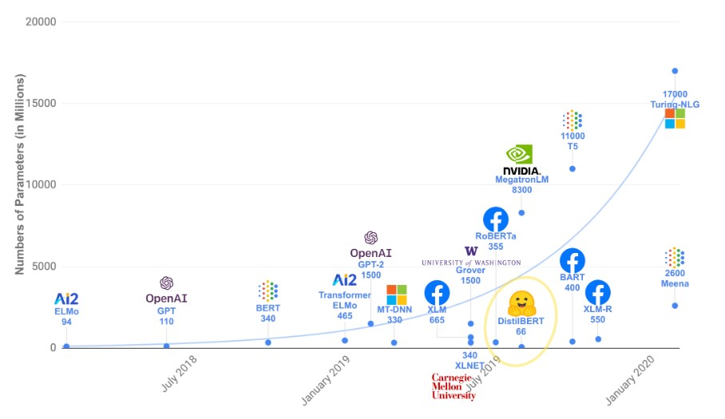

&nbsp;&nbsp;&nbsp;&nbsp;&nbsp;&nbsp;&nbsp;&nbsp;大语言模型的快速发展对自然语言处理领域产生了革命性的影响 [12, 128, 131]。 这些强大的模型在各种 NLP 任务 —— 从自然语言理解（NLU）到生成式任务（generation tasks）—— 中都展现出了巨大的潜力，甚至为通用人工智能（AGI）铺平了道路。 但另一方面，如何有效和高效地利用这些模型，就需要了解它们的实际能力和局限性， 还需要考虑具体 NLP 任务及其涉及的数据。<br>

- 大模型概述 <br>
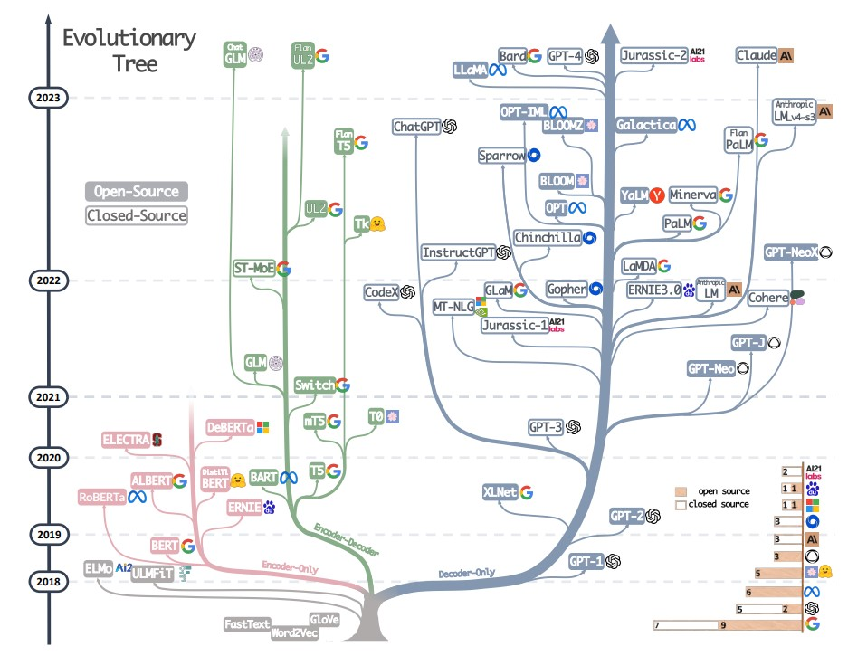

- [论文链接](https://arxiv.org/pdf/2304.13712.pdf)

- 大模型榜单 <br>
[tensorboard](https://huggingface.co/spaces/opencompass/opencompass-llm-leaderboard)


# 4 BERT + CRF(Conditional Random Field) 实现命名实体识别(NER) 任务
## 4.1 任务概述
&nbsp;&nbsp;&nbsp;&nbsp;&nbsp;&nbsp;&nbsp;&nbsp;使用 BERT+CRF模型架构实现NER任务，大致分为两个阶段：<br>
- 使用 BERT 生成发射分数（标签向量）；
- 基于发射分数使用CRF解码最优的标签路径 <br>

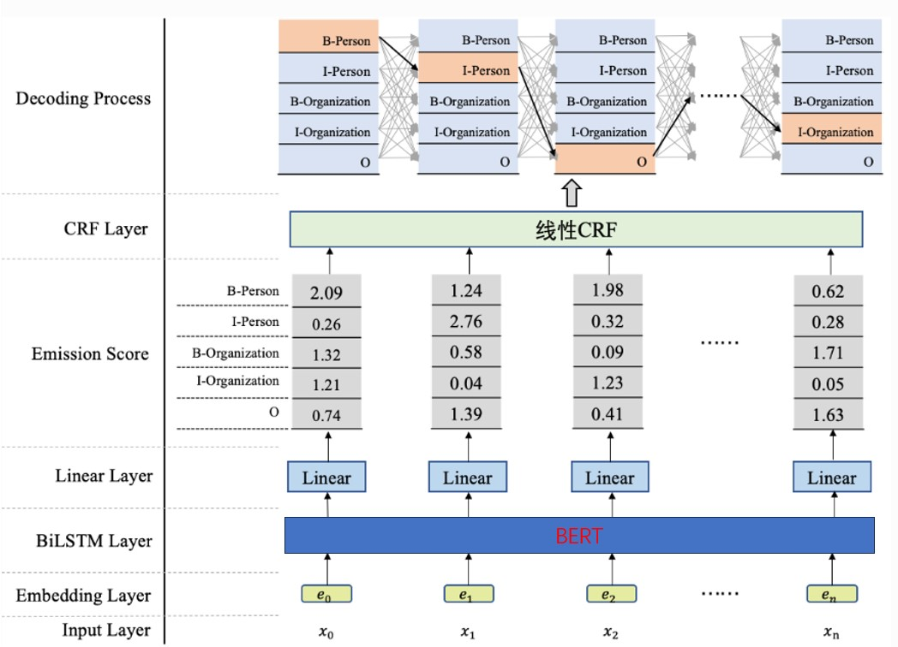

&nbsp;&nbsp;&nbsp;&nbsp;&nbsp;&nbsp;&nbsp;&nbsp;从上图可以看到，在 BERT 上方我们添加了一个CRF层。具体地，在基于 BERT 获得各个位置的标签向量之后，这些标签向量将被作为**发射分数**传入CRF中，发射这个概念是从CRF里面带出来的，之后详述。<br>

&nbsp;&nbsp;&nbsp;&nbsp;&nbsp;&nbsp;&nbsp;&nbsp;这些发射分数（标签向量）传入CRF之后，CRF会据此解码出一串标签序列。那么问题来了，上图最上边的解码过程可以看出，这里可能对应着很多条不同的路径，例如：<br>
- B-Person, I-Person, O, …, I-Organization <br>
- B-Organization, I-Person, O, …, I-Person <br>
- B-Organization, I-Organization, O, …, O <br>

&nbsp;&nbsp;&nbsp;&nbsp;&nbsp;&nbsp;&nbsp;&nbsp;CRF的作用就是在所有可能的路径中，找出得出概率最大，效果最优的一条路径，那这个标签序列就是模型的输出。<br>

## 4.2 CRF 原理详解
### 4.2.1 线性CRF的定义
&nbsp;&nbsp;&nbsp;&nbsp;&nbsp;&nbsp;&nbsp;&nbsp;通常我们会使用线性链CRF来建模NER任务，所以本实验将聚焦在线性链CRF来探讨。那什么是线性链CRF呢，我们来看下李航老师在《统计学习方法》书中的定义：<br>

&nbsp;&nbsp;&nbsp;&nbsp;&nbsp;&nbsp;&nbsp;&nbsp;设 $X=[x_{1}, x_{2}, \ldots, x_{n} ], Y = [y_{1}, y_{2}, \ldots, y_{n}]$ 均为线性链表示的随机变量序列，若在给定随机变量序列的 X 的条件下，随机变量序列 Y 的条件概率分布 $P(Y|X)$ 构成条件随机场，即满足马尔可夫性: <br>

$$P(y_{i} \mid X, y_{1}, \ldots, y_{i-1}, y_{i+1}, \ldots, y_{n})=P(y_{i} \mid X, y_{i-1}, y_{i+1})$$

*(注意：i = 1 or n 时 考虑单边即可)*

&nbsp;&nbsp;&nbsp;&nbsp;&nbsp;&nbsp;&nbsp;&nbsp;则称 $P(Y|X)$ 为线性链条件随机场，线性体现在线性序列中的元素之间存在明确的顺序关系。每个元素都有一个前继和后继元素，除了第一个元素没有前继元素，最后一个元素没有后继元素。<br>

&nbsp;&nbsp;&nbsp;&nbsp;&nbsp;&nbsp;&nbsp;&nbsp;一种经典的线性链CRF的结构图如下：<br>

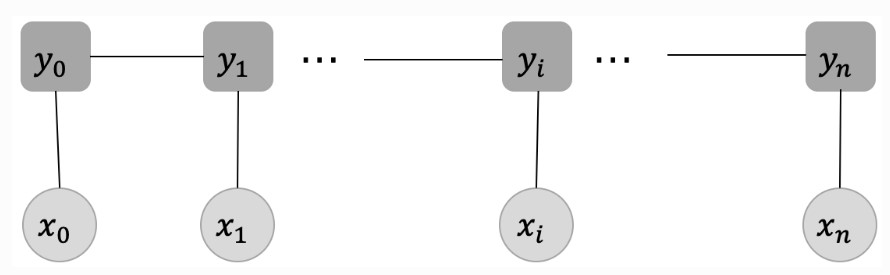

1. 输入序列  X  和输出序列  Y  是线性序列; <br>
2. 每个标签  $y_{i}$  的产生，只与当前位置的输入 $x_{i}$ 还有 $y_{i}$  直接相连的两个邻居  $y_{i-1} , y_{i+1}$ 有关，与其他的标签和输入没有关系。 <br>

### 4.2.2 发射分数

&nbsp;&nbsp;&nbsp;&nbsp;&nbsp;&nbsp;&nbsp;&nbsp;上节中， $x=[x_{0}, x_{1}, \ldots, x_{i}, \ldots, x_{n}]$ 代表输入变量，对应到我们当前任务就是输入文本序列  $y=[y_{0}, y_{1}, \ldots, y_{i}, \ldots, y_{n}]$  代表相应的标签序列.<br>

&nbsp;&nbsp;&nbsp;&nbsp;&nbsp;&nbsp;&nbsp;&nbsp;每个输入 $x_{i}$ 均对应着一个标签 $y_{i}$ ，这一步对应的就是**发射分数(emission score)**，它指示了当前的输入 $x_{i}$ 应该对应什么样的标签. 发射分数的生成过程如下：<br>

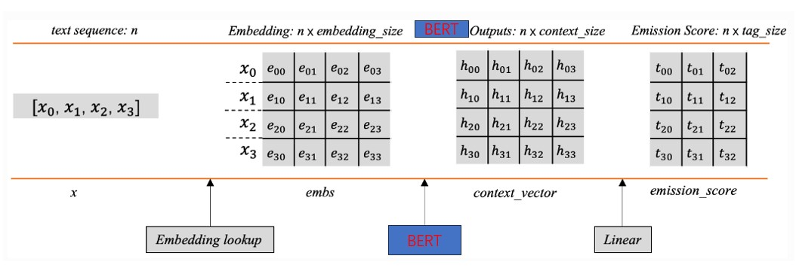

&nbsp;&nbsp;&nbsp;&nbsp;&nbsp;&nbsp;&nbsp;&nbsp;每个字词对应一行的标签分数（图3中只设置了三列，代表一共有3个标签），例如，  $x_{0}$  对第一个标签的分数预测为  $t_{00}$  ，对第二个标签的分数预测为  $t_{01}$  ，对第三个标签的分数预测为  $t_{02}$  ，依次类推。<br>

### 4.2.3 转移分数
&nbsp;&nbsp;&nbsp;&nbsp;&nbsp;&nbsp;&nbsp;&nbsp;在每个标签  $y_{i}$  之间也存在连线，它表示当前位置的标签  $y_{i}$  向下一个位置的标签  $y_{i+1}$  的一种转移。举个例子，假设当前位置的标签是"B-Person"，那下一个位置就很有可能是"IPerson"标签，即标签"B-Person"向"I-Person"转移的概率会比较大。我们用**转移分数**表示一个标签向另一个标签转移的分数，分数越高，转移概率就越大，反之亦然。下图展示了记录转移分数的矩阵。<br>

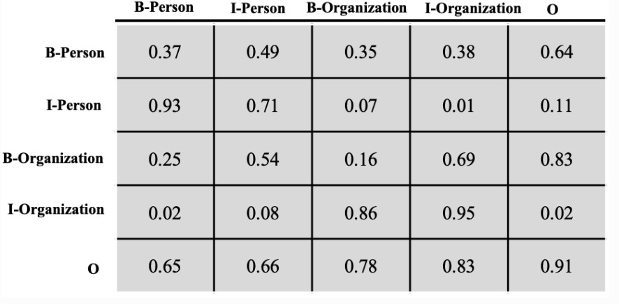

&nbsp;&nbsp;&nbsp;&nbsp;&nbsp;&nbsp;&nbsp;&nbsp;假设我们现在有个标签序列：B-Person, I-Person, O, O，B-Organization, I-Organization。那么这个序列的转移分数可按照如下方式计算：<br>

$$Seq_{t}=T_{I-Person,B-Person}+T_{O, I-Person}+T_{O, O}+T_{O, B-Organization}+T_{B-Organization,I-Organization }$$

&nbsp;&nbsp;&nbsp;&nbsp;&nbsp;&nbsp;&nbsp;&nbsp;这个转移分数矩阵是CRF中的一个可学习的参数矩阵，它的存在能够帮助我们显示地去建模标签之间的转移关系，提高命名实体识别的准确率。<br>

## 4.2.4 CRF 的损失函数计算
- [参考链接](https://paddlepedia.readthedocs.io/en/latest/tutorials/natural_language_processing/ner/bilstm_crf.html)

### 4.2.5 CRF的Viterbi解码

&nbsp;&nbsp;&nbsp;&nbsp;&nbsp;&nbsp;&nbsp;&nbsp;在一般的条件随机场（CRF）模型中，通常假设当前时刻的状态只与前一个时刻的状态相关，即满足一阶马尔可夫性质。这意味着维特比算法中的局部最优性原理仅考虑前一个时刻的最优路径。然而，在某些实际问题中，可能存在更复杂的依赖关系，即当前时刻的状态与前面多个时刻的状态相关。这种情况下，简单的一阶马尔可夫性假设可能不足以捕捉到完整的依赖关系。<br>

- [参考链接](https://paddlepedia.readthedocs.io/en/latest/tutorials/natural_language_processing/ner/bilstm_crf.html)

# 5 代码详解

## 5.1 真实路径得分计算

```python
    def _compute_score(self, emissions: torch.Tensor, tags: torch.LongTensor, mask: torch.ByteTensor) -> torch.Tensor:
        # emissions: (batch_size, seq_length, num_tags) # 发射分数
        # tags: (batch_size, seq_length) # 标签
        # mask: (batch_size, seq_length) # 掩模
        batch_size, seq_length = tags.shape
        mask = mask.float()

        # Start transition score and first emission 初始化 转移分数 和 第一个发射分数
        # shape: (batch_size,)
        score = self.start_transitions[tags[:, 0]] # 收单词转移分数
        score += emissions[torch.arange(batch_size), 0, tags[:, 0]] # 首单词发射分数

        for i in range(1, seq_length):
            # Transition score to next tag, only added if next timestep is valid (mask == 1)
            # shape: (batch_size,)
            score += self.transitions[tags[:, i - 1], tags[:, i]] * mask[:, i] # 当前单词转移分数
            # Emission score for next tag, only added if next timestep is valid (mask == 1) 
            # shape: (batch_size,)
            score += emissions[torch.arange(batch_size), i, tags[:, i]] * mask[:, i] # 当前单词发射分数

        # End transition score
        # shape: (batch_size,)
        seq_ends = mask.long().sum(dim=1) - 1
        # shape: (batch_size,)
        last_tags = tags[torch.arange(batch_size), seq_ends] 
        # shape: (batch_size,)
        score += self.end_transitions[last_tags] # 最后单词转移分数

        return score 
```

## 5.2 总路径得分计算

```python
def _compute_normalizer(self, emissions: torch.Tensor, mask: torch.ByteTensor) -> torch.Tensor:
        # emissions: (batch_size, seq_length, num_tags)
        # mask: (batch_size, seq_length)
        seq_length = emissions.size(1) # 总的 seq 长度

        # Start transition score and first emission; score has size of
        # (batch_size, num_tags) where for each batch, the j-th column stores
        # the score that the first timestep has tag j
        # shape: (batch_size, num_tags)
        score = self.start_transitions + emissions[:, 0] # 初始分数

        for i in range(1, seq_length):
            # Broadcast score for every possible next tag
            # shape: (batch_size, num_tags, 1)
            broadcast_score = score.unsqueeze(2) # 将 shape: (batch_size, num_tags) -->  # shape: (batch_size, num_tags, 1)

            # Broadcast emission score for every possible current tag
            # shape: (batch_size, 1, num_tags)
            broadcast_emissions = emissions[:, i].unsqueeze(1) # 当前seq 的发生分数 在 1 轴上 unsqueeze

            # Compute the score tensor of size (batch_size, num_tags, num_tags) where
            # for each sample, entry at row i and column j stores the sum of scores of all
            # possible tag sequences so far that end with transitioning from tag i to tag j
            # and emitting
            # shape: (batch_size, num_tags, num_tags)
            next_score = broadcast_score + self.transitions + broadcast_emissions

            # Sum over all possible current tags, but we're in score space, so a sum
            # becomes a log-sum-exp: for each sample, entry i stores the sum of scores of
            # all possible tag sequences so far, that end in tag i
            # shape: (batch_size, num_tags)
            next_score = torch.logsumexp(next_score, dim=1)

            # Set score to the next score if this timestep is valid (mask == 1)
            # shape: (batch_size, num_tags)
            score = torch.where(mask[:, i].unsqueeze(1).bool(), next_score, score)

        # End transition score
        # shape: (batch_size, num_tags)
        score += self.end_transitions

        # Sum (log-sum-exp) over all possible tags
        # shape: (batch_size,)
        return torch.logsumexp(score, dim=1)
```

## 5.3 Viterbi 解码过程
```python
def _viterbi_decode_nbest(self, emissions: torch.FloatTensor, mask: torch.ByteTensor,
                              nbest: int, pad_tag: Optional[int] = None) -> List[List[List[int]]]:
        # emissions: (batch_size, seq_length, num_tags)
        # mask: (batch_size, seq_length)
        # return: (nbest, batch_size, seq_length)
        if pad_tag is None:
            pad_tag = 0

        device = emissions.device
        batch_size, seq_length = mask.shape

        # Start transition and first emission
        # shape: (batch_size, num_tags)
        score = self.start_transitions + emissions[:, 0] # 初始score
        history_idx = torch.zeros((batch_size, seq_length, self.num_tags, nbest), dtype=torch.long, device=device) # 记录对应位置相应标签结尾的路径中，分数最大(或前nbset大)的路径在前一个位置的标签索引
        oor_idx = torch.zeros((batch_size, self.num_tags, nbest), dtype=torch.long, device=device) # 被mask 的index 设置为0
        oor_tag = torch.full((batch_size, seq_length, nbest), pad_tag, dtype=torch.long, device=device) # 被mask 住的tag 固定为 end tag

        # - score is a tensor of size (batch_size, num_tags) where for every batch,
        #   value at column j stores the score of the best tag sequence so far that ends
        #   with tag j
        # - history_idx saves where the best tags candidate transitioned from; this is used
        #   when we trace back the best tag sequence
        # - oor_idx saves the best tags candidate transitioned from at the positions
        #   where mask is 0, i.e. out of range (oor)

        # Viterbi algorithm recursive case: we compute the score of the best tag sequence
        # for every possible next tag
        for i in range(1, seq_length): # 从step 1 开始遍历
            if i == 1:
                broadcast_score = score.unsqueeze(-1) # 维度扩展 [16, 7] --> [16, 7, 1]
                broadcast_emission = emissions[:, i].unsqueeze(1) # [16, 7] --> [16, 1, 7]
                # shape: (batch_size, num_tags, num_tags)
                next_score = broadcast_score + self.transitions + broadcast_emission # 下step 中所有可能路径的 score 矩阵
            else:
                broadcast_score = score.unsqueeze(-1) # [16, 7, 2] --> [16, 7, 2, 1]
                broadcast_emission = emissions[:, i].unsqueeze(1).unsqueeze(2) # [16, 7] --> [16, 1, 1, 7]
                # shape: (batch_size, num_tags, nbest, num_tags) 
                next_score = broadcast_score + self.transitions.unsqueeze(1) + broadcast_emission # [16, 7, 2, 7]

            # Find the top `nbest` maximum score over all possible current tag
            # shape: (batch_size, nbest, num_tags) --> [16, 2, 7]
            next_score, indices = next_score.view(batch_size, -1, self.num_tags).topk(nbest, dim=1) # 在 nbest * tags 个候选项中 选取nbest个最佳路径的index

            if i == 1:
                score = score.unsqueeze(-1).expand(-1, -1, nbest) # 只有一条路径，所以要broadcast 一下： [16, 7] --> [16, 7, 2]
                indices = indices * nbest # index 融合，乘以nbest

            # convert to shape: (batch_size, num_tags, nbest)
            next_score = next_score.transpose(2, 1) # nbest 防置到最后一个维度
            indices = indices.transpose(2, 1) # index 同样转置

            # Set score to the next score if this timestep is valid (mask == 1)
            # and save the index that produces the next score
            # shape: (batch_size, num_tags, nbest)
            score = torch.where(mask[:, i].unsqueeze(-1).unsqueeze(-1).bool(), next_score, score) # 超过句子长度则 用原score代替
            indices = torch.where(mask[:, i].unsqueeze(-1).unsqueeze(-1).bool(), indices, oor_idx) # 超过句子长度则 用oor_idx 代替
            history_idx[:, i - 1] = indices # 记录当前idx 的 indices 到 history_idx

        # End transition score shape: (batch_size, num_tags, nbest)
        end_score = score + self.end_transitions.unsqueeze(-1) # last seq score
        _, end_tag = end_score.view(batch_size, -1).topk(nbest, dim=1) # 最后的end_score 的topk

        # shape: (batch_size,)
        seq_ends = mask.long().sum(dim=1) - 1 # 获取每条句子长度

        # # 在每个序列的末尾（最后一个具有 mask == 1 的位置）插入最佳标签。
        # insert the best tag at each sequence end (last position with mask == 1)       
        history_idx.scatter_(1, seq_ends.view(-1, 1, 1, 1).expand(-1, 1, self.num_tags, nbest),
                             end_tag.view(-1, 1, 1, nbest).expand(-1, 1, self.num_tags, nbest)) 

        # The most probable path for each sequence
        best_tags_arr = torch.zeros((batch_size, seq_length, nbest), dtype=torch.long, device=device) # 每条句子记录两条最佳路径
        best_tags = torch.arange(nbest, dtype=torch.long, device=device).view(1, -1).expand(batch_size, -1) # 记录当前idx 对应的tags 上 一个 idx 的索引
        for idx in range(seq_length - 1, -1, -1):
            best_tags = torch.gather(history_idx[:, idx].view(batch_size, -1), 1, best_tags) # 上一位置最佳tags的索引
            best_tags_arr[:, idx] = torch.div(best_tags.data.view(batch_size, -1), nbest, rounding_mode='floor') # 将每个位置的最佳idx记录下来

        return torch.where(mask.unsqueeze(-1).bool(), best_tags_arr, oor_tag).permute(2, 0, 1) # 排除被mask 的单词 --> [2, 16, 72]
```

## 5.4 f1 score 的计算
```python
def evaluate(data):
    # X: 真正例，Y:预测为正例的个数；Z：实际正例个数
    X, Y, Z = 1e-10, 1e-10, 1e-10
    X2, Y2, Z2 = 1e-10, 1e-10, 1e-10
    for token_ids, label in tqdm(data):
        scores = model.predict(token_ids)  # [btz, seq_len] --> [2, 16, 72]
        attention_mask = label.gt(0) # true 和 false 判断

        # token粒度
        X += (scores.eq(label) * attention_mask).sum().item() # 真正例个数
        Y += scores.gt(0).sum().item() # 预测的正例个数
        Z += label.gt(0).sum().item() # 实际的正例个数

        # entity粒度
        entity_pred = trans_entity2tuple(scores) # 获取预测出来的实体
        entity_true = trans_entity2tuple(label) # 获取实际的实体
        X2 += len(entity_pred.intersection(entity_true)) # 预测正确的实体个数
        Y2 += len(entity_pred) # 预测出的实体个数
        Z2 += len(entity_true) # 真实的实体个数
    f1, precision, recall = 2 * X / (Y + Z), X / Y, X / Z
    f2, precision2, recall2 = 2 * X2 / (Y2 + Z2), X2/ Y2, X2 / Z2
    return f1, precision, recall, f2, precision2, recall2
```
